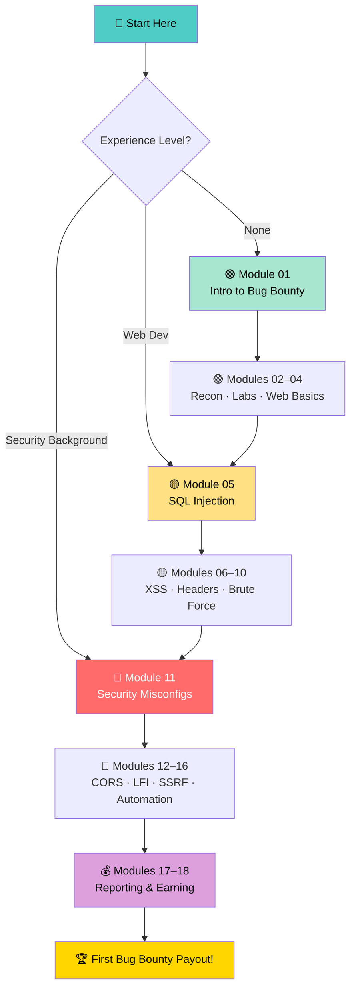
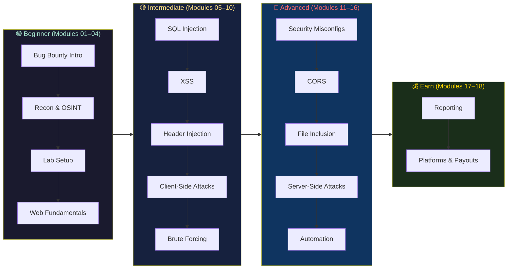

```
╔═══════════════════════════════════════════════════════════════════════════════╗
║                                                                               ║
║   ██████╗ ██╗   ██╗ ██████╗     ██████╗  ██████╗ ██╗   ██╗███╗   ██╗████████╗╗
║   ██╔══██╗██║   ██║██╔════╝     ██╔══██╗██╔═══██╗██║   ██║████╗  ██║╚══██╔══╝║
║   ██████╔╝██║   ██║██║  ███╗    ██████╔╝██║   ██║██║   ██║██╔██╗ ██║   ██║   ║
║   ██╔══██╗██║   ██║██║   ██║    ██╔══██╗██║   ██║██║   ██║██║╚██╗██║   ██║   ║
║   ██████╔╝╚██████╔╝╚██████╔╝    ██████╔╝╚██████╔╝╚██████╔╝██║ ╚████║   ██║   ║
║   ╚═════╝  ╚═════╝  ╚═════╝     ╚═════╝  ╚═════╝  ╚═════╝ ╚═╝  ╚═══╝   ╚═╝   ║
║                                                                               ║
║        ███╗   ███╗ █████╗ ███████╗████████╗███████╗██████╗ ██╗   ██╗         ║
║        ████╗ ████║██╔══██╗██╔════╝╚══██╔══╝██╔════╝██╔══██╗╚██╗ ██╔╝         ║
║        ██╔████╔██║███████║███████╗   ██║   █████╗  ██████╔╝ ╚████╔╝          ║
║        ██║╚██╔╝██║██╔══██║╚════██║   ██║   ██╔══╝  ██╔══██╗  ╚██╔╝           ║
║        ██║ ╚═╝ ██║██║  ██║███████║   ██║   ███████╗██║  ██║   ██║            ║
║        ╚═╝     ╚═╝╚═╝  ╚═╝╚══════╝   ╚═╝   ╚══════╝╚═╝  ╚═╝   ╚═╝            ║
║                                                                               ║
║                    L E A R N  →  H U N T  →  E A R N                         ║
║          The Most Comprehensive, Hands-On Bug Bounty Course on GitHub         ║
╚═══════════════════════════════════════════════════════════════════════════════╝
```

<div align="center">

[](https://github.com/vibhor-777/Bug-Bounty-Mastery/stargazers)
[](https://github.com/vibhor-777/Bug-Bounty-Mastery/network/members)
[](LICENSE)
[](https://github.com/vibhor-777/Bug-Bounty-Mastery/graphs/contributors)
[](https://github.com/vibhor-777/Bug-Bounty-Mastery/commits/main)
[](https://github.com/vibhor-777/Bug-Bounty-Mastery/issues)

**The most comprehensive, hands-on bug bounty course on GitHub — from zero to your first payout, completely free.**

[🎯 Overview](#-overview) • [🚀 Quick Start](#-quick-start) • [📚 Modules](#-module-navigation) • [🧪 Labs](#-hands-on-labs) • [🤝 Contribute](#-contributing)

</div>

---

## 📋 Table of Contents

| Section | Description |
|---------|-------------|
| [🎯 Overview](#-overview) | What this course covers and who it's for |
| [✨ Features](#-features) | Key learning modules and capabilities |
| [🚀 Quick Start](#-quick-start) | Start your bug bounty journey in minutes |
| [📁 Repository Structure](#-repository-structure) | Visual directory tree of the learning path |
| [🗺️ Learning Roadmap](#️-learning-roadmap) | Progression from beginner to advanced |
| [📚 Module Navigation](#-module-navigation) | All 18 modules with topics covered |
| [✅ Progress Tracker](#-progress-tracker) | Track your learning journey |
| [🧪 Hands-on Labs](#-hands-on-labs) | Practice platforms and lab environments |
| [💰 Earning With Bug Bounty](#-earning-with-bug-bounty) | Platforms and strategies to get paid |
| [🤝 Contributing](#-contributing) | How to contribute to this project |
| [📜 License](#-license) | License information |

---

## 🎯 Overview

> **Bug Bounty Mastery** is an open-source, structured learning path that takes you from complete beginner to earning your first bug bounty payout — step by step, hands-on, and completely free.

This repository contains:

- 🔍 **18 Comprehensive Modules** — Structured learning from web basics to advanced server-side attacks
- 🧪 **Hands-on Labs** — Practical exercises on industry-standard lab platforms
- 🤖 **Automation Techniques** — Build recon pipelines with subfinder, amass, httpx, and nuclei
- 📝 **Professional Reporting** — Write reports that get triaged and paid
- 💰 **Earning Strategies** — Step-by-step path to your first payout
- 🔬 **Real-World Examples** — Techniques used by real bug bounty hunters

```
┌─────────────────────────────────────────────────────────┐
│                  THE LEARNING STACK                      │
├─────────────────────────────────────────────────────────┤
│  🟢  Beginner Foundation  → Web, Recon, Lab Setup       │
│  🟡  Core Vulnerabilities → SQLi, XSS, Injection        │
│  🔴  Advanced Techniques  → SSRF, XXE, SSTI, CORS       │
│  🤖  Automation           → Pipelines & Scripts         │
│  📝  Reporting            → Professional PoC Writing    │
│  💰  Earning              → Platforms & Payout Tactics  │
└─────────────────────────────────────────────────────────┘
```

### 👤 Who This Is For

| Level | Description |
|-------|-------------|
| 🟢 **Beginners** | No prior security experience — start from Module 1 |
| 🟡 **Developers** | Already know web tech — jump to Module 5 |
| 🔴 **Security Enthusiasts** | Know the basics — fast-track to advanced modules |
| 💼 **Professionals** | Use as a reference and sharpen specific skills |

---

## ✨ Features

| Feature | Description |
|---------|-------------|
| 🎯 **Structured Path** | 18 modules organized from beginner to advanced |
| 🛡️ **Ethical Focus** | Every technique paired with prevention and legal context |
| 🔍 **Recon Mastery** | OSINT, subdomain enumeration, and automated recon |
| 💉 **Injection Attacks** | SQLi, XSS, Header Injection, SSTI, and more |
| 🤖 **Automation** | Recon pipelines with industry-standard tools |
| 📝 **Report Writing** | Templates and guidance for professional PoC reports |
| 💰 **Monetization** | Platform guides and first-payout strategies |
| 🧪 **Lab Integration** | Links to PortSwigger, TryHackMe, HackTheBox, and more |
| 🌍 **Community** | Open to contributions from the global security community |
| 📋 **Progress Tracking** | Fork and track your journey through all 18 modules |

---

## 🚀 Quick Start

### Step 1 — Clone the Repository

```bash
git clone https://github.com/vibhor-777/Bug-Bounty-Mastery.git
cd Bug-Bounty-Mastery
```

### Step 2 — Choose Your Starting Point

```bash
# 🟢 Complete Beginner? Start here:
open "01. Introduction to Bug Bounty/README.md"

# 🟡 Know web development? Start here:
open "05. SQL Injection/README.md"

# 🔴 Experienced? Jump to advanced:
open "11. Security Misconfigurations/README.md"
```

### Step 3 — Set Up Your Lab

```bash
# Option A: Use PortSwigger Web Academy (recommended, free)
# https://portswigger.net/web-security

# Option B: Run DVWA locally with Docker
docker run --rm -it -p 80:80 vulnerables/web-dvwa

# Option C: Run OWASP Juice Shop locally
docker run --rm -p 3000:3000 bkimminich/juice-shop
```

### Step 4 — Track Your Progress

> 💡 **Tip:** Fork this repo and check off modules in the [Progress Tracker](#-progress-tracker) as you complete them!

---

## 📁 Repository Structure

```
Bug-Bounty-Mastery/
├── 📄 README.md                              # This file
├── 📄 CONTRIBUTING.md                        # Contribution guidelines
│
├── 🟢 01. Introduction to Bug Bounty/        # Beginner
│   └── README.md                             # Platforms, programs, legal, mindset
│
├── 🟢 02. Information Gathering/             # Beginner
│   └── README.md                             # OSINT, subdomain enum, recon
│
├── 🟢 03. Setting Up Labs/                   # Beginner
│   └── README.md                             # DVWA, Juice Shop, Burp Suite
│
├── 🟢 04. Introduction to Web/              # Beginner
│   └── README.md                             # HTTP, cookies, sessions, headers
│
├── 🟡 05. SQL Injection/                     # Intermediate
│   └── README.md                             # Union, blind, time-based SQLi
│
├── 🟡 06. Web Application Basics/           # Intermediate
│   └── README.md                             # Auth, input validation, session mgmt
│
├── 🟡 07. Cross Site Scripting (XSS)/       # Intermediate
│   └── README.md                             # Reflected, stored, DOM-based XSS
│
├── 🟡 08. Header Injection/                 # Intermediate
│   └── README.md                             # HTTP response splitting, CRLF
│
├── 🟡 09. Client Side Attacks/              # Intermediate
│   └── README.md                             # CSRF, clickjacking, open redirect
│
├── 🟡 10. Brute Forcing/                    # Intermediate
│   └── README.md                             # Hydra, ffuf, rate limit bypass
│
├── 🔴 11. Security Misconfigurations/       # Advanced
│   └── README.md                             # Default creds, exposed admin panels
│
├── 🔴 12. Insecure CORS/                    # Advanced
│   └── README.md                             # Origin bypass, credential leaks
│
├── 🔴 13. File Inclusion/                   # Advanced
│   └── README.md                             # LFI, RFI, path traversal
│
├── 🔴 14. Server-Side Attacks/              # Advanced
│   └── README.md                             # SSRF, XXE, SSTI
│
├── 🔴 15. Insecure Captcha/                 # Advanced
│   └── README.md                             # CAPTCHA bypass techniques
│
├── 🔴 16. Automating VAPT/                  # Advanced
│   └── README.md                             # Recon pipelines, nuclei, scripts
│
├── 💰 17. Documenting & Reporting/          # Earn
│   └── README.md                             # Professional reports, PoC writing
│
└── 💰 18. Conclusion/                       # Earn
    └── README.md                             # Next steps, platforms, earning guide
```

---

## 🗺️ Learning Roadmap



### Phase Breakdown



---

## 📚 Module Navigation

| # | Module | Level | Topics Covered |
|---|--------|-------|---------------|
| 01 | [🐞 Introduction to Bug Bounty](./01.%20Introduction%20to%20Bug%20Bounty/README.md) | 🟢 Beginner | Platforms, programs, legal, mindset |
| 02 | [🔍 Information Gathering](./02.%20Information%20Gathering/README.md) | 🟢 Beginner | OSINT, subdomain enum, recon |
| 03 | [🧪 Setting Up Labs](./03.%20Setting%20Up%20Labs/README.md) | 🟢 Beginner | DVWA, Juice Shop, Burp Suite |
| 04 | [🌐 Introduction to Web](./04.%20Introduction%20to%20Web/README.md) | 🟢 Beginner | HTTP, cookies, sessions, headers |
| 05 | [💉 SQL Injection](./05.%20SQL%20Injection/README.md) | 🟡 Intermediate | Union, blind, time-based SQLi |
| 06 | [🔧 Web Application Basics](./06.%20Web%20Application%20Basics/README.md) | 🟡 Intermediate | Auth, input validation, session mgmt |
| 07 | [⚡ Cross-Site Scripting (XSS)](./07.%20Cross%20Site%20Scripting%20(XSS)/README.md) | 🟡 Intermediate | Reflected, stored, DOM-based XSS |
| 08 | [📩 Header Injection](./08.%20Header%20Injection/README.md) | 🟡 Intermediate | HTTP response splitting, CRLF |
| 09 | [🖥️ Client-Side Attacks](./09.%20Client%20Side%20Attacks/README.md) | 🟡 Intermediate | CSRF, clickjacking, open redirect |
| 10 | [🔓 Brute Forcing](./10.%20Brute%20Forcing/README.md) | 🟡 Intermediate | Hydra, ffuf, rate limit bypass |
| 11 | [⚠️ Security Misconfigurations](./11.%20Security%20Misconfigurations/README.md) | 🔴 Advanced | Default creds, exposed admin panels |
| 12 | [🌍 Insecure CORS](./12.%20Insecure%20CORS/README.md) | 🔴 Advanced | Origin bypass, credential leaks |
| 13 | [📁 File Inclusion](./13.%20File%20Inclusion/README.md) | 🔴 Advanced | LFI, RFI, path traversal |
| 14 | [🖧 Server-Side Attacks](./14.%20Server-Side%20Attacks/README.md) | 🔴 Advanced | SSRF, XXE, SSTI |
| 15 | [🤖 Insecure Captcha](./15.%20Insecure%20Captcha/README.md) | 🔴 Advanced | CAPTCHA bypass techniques |
| 16 | [⚙️ Automating VAPT](./16.%20Automating%20VAPT/README.md) | 🔴 Advanced | Recon pipelines, nuclei, scripts |
| 17 | [📝 Documenting & Reporting](./17.%20Documenting%20%26%20Reporting/README.md) | 💰 Earn | Professional reports, PoC writing |
| 18 | [🏆 Conclusion](./18.%20Conclusion/README.md) | 💰 Earn | Next steps, platforms, earning guide |

---

## ✅ Progress Tracker

Track your learning journey through all 18 modules:

- [ ] `01` Introduction to Bug Bounty
- [ ] `02` Information Gathering
- [ ] `03` Setting Up Labs
- [ ] `04` Introduction to Web
- [ ] `05` SQL Injection
- [ ] `06` Web Application Basics
- [ ] `07` Cross-Site Scripting (XSS)
- [ ] `08` Header Injection
- [ ] `09` Client-Side Attacks
- [ ] `10` Brute Forcing
- [ ] `11` Security Misconfigurations
- [ ] `12` Insecure CORS
- [ ] `13` File Inclusion
- [ ] `14` Server-Side Attacks
- [ ] `15` Insecure Captcha
- [ ] `16` Automating VAPT
- [ ] `17` Documenting & Reporting
- [ ] `18` Conclusion

> 💡 **Tip:** Fork this repo and check off modules as you complete them!

---

## 🧪 Hands-on Labs

### Practice Platforms

Practice safely and legally on these industry-standard platforms:

| Platform | URL | Best For |
|----------|-----|----------|
| 🕷️ **PortSwigger Web Academy** | [portswigger.net/web-security](https://portswigger.net/web-security) | All web vulns — best structured labs, free |
| 🧱 **DVWA** | [dvwa.co.uk](https://dvwa.co.uk) | Beginner-friendly local lab environment |
| 🍹 **OWASP Juice Shop** | [owasp.org/www-project-juice-shop](https://owasp.org/www-project-juice-shop/) | Modern app vulnerabilities, gamified |
| 🔐 **TryHackMe** | [tryhackme.com](https://tryhackme.com) | Guided rooms perfect for beginners |
| 📦 **HackTheBox** | [hackthebox.com](https://hackthebox.com) | Real-world challenge machines |
| 🎯 **VulnHub** | [vulnhub.com](https://vulnhub.com) | Downloadable vulnerable VMs |
| 🌐 **PentesterLab** | [pentesterlab.com](https://pentesterlab.com) | Web-focused with badges and certificates |

### Quick Lab Setup

<details>
<summary><b>🧱 DVWA — Local Setup with Docker</b></summary>

```bash
# Pull and run DVWA
docker run --rm -it -p 80:80 vulnerables/web-dvwa

# Open in browser
open http://localhost

# Default credentials
# Username: admin
# Password: password
```

After login, navigate to **DVWA Security** and set level to **Low** to start.

</details>

<details>
<summary><b>🍹 OWASP Juice Shop — Local Setup</b></summary>

```bash
# Run with Docker
docker run --rm -p 3000:3000 bkimminich/juice-shop

# Open in browser
open http://localhost:3000
```

Juice Shop has 100+ challenges. Start with the 1-star challenges!

</details>

<details>
<summary><b>🔧 Burp Suite — Essential Proxy Setup</b></summary>

```bash
# Download Burp Suite Community Edition (free)
# https://portswigger.net/burp/communitydownload

# Key setup steps:
# 1. Set proxy listener on 127.0.0.1:8080
# 2. Configure browser to use Burp as proxy
# 3. Install Burp CA certificate in browser
# 4. Start intercepting traffic
```

</details>

---

## 💰 Earning With Bug Bounty

### 🏁 Bug Bounty Platforms

| Platform | Focus | URL |
|----------|-------|-----|
| 💰 **HackerOne** | Web apps, APIs, public & private programs | [hackerone.com](https://hackerone.com) |
| 🔒 **Bugcrowd** | Broad scope programs, IoT, mobile | [bugcrowd.com](https://bugcrowd.com) |
| 🌐 **Intigriti** | European programs, responsive triagers | [intigriti.com](https://intigriti.com) |
| ⚡ **Synack** | Vetted researchers, higher-paid programs | [synack.com](https://synack.com) |
| 🎯 **YesWeHack** | EU-focused, government programs | [yeswehack.com](https://yeswehack.com) |

### 🎯 First Payout Strategy

1. **Start with public programs** that have broad scope and active triagers
2. **Focus on low-hanging fruit** first — misconfigurations and information disclosure
3. **Read past disclosed reports** on HackerOne Hacktivity to understand what gets rewarded
4. **Document everything** — screenshots, HTTP requests, responses, and reproduction steps
5. **Write clear, reproducible** proof-of-concept reports using Module 17's template
6. **Be patient and professional** in all communications with program teams

---

## 🤝 Contributing

We welcome contributions from researchers, developers, and security enthusiasts!

**Ways to contribute:**
- 📝 Add new techniques, tools, or examples to existing modules
- 🐛 Fix errors or outdated information in existing content
- 🔗 Add new lab resources, tools, or references
- ✅ Create practical exercises for any module
- 💡 Share real-world bug bounty stories (anonymized)
- 🌍 Translate content to make it accessible in other languages

Please read [CONTRIBUTING.md](CONTRIBUTING.md) for detailed guidelines.

```bash
# Fork → Clone → Branch → Commit → PR
git checkout -b feature/add-ssrf-techniques
git commit -m "Add: SSRF bypass techniques to Module 14"
git push origin feature/add-ssrf-techniques
```

---

## 📈 Star History

[](https://star-history.com/#vibhor-777/Bug-Bounty-Mastery&Date)

---

## 📜 License

This project is licensed under the **MIT License** — see [LICENSE](LICENSE) for details.

> All content is for **educational and research purposes only**. Only use these techniques on systems you have **explicit written permission** to test. Unauthorized testing is illegal and unethical.

---

<div align="center">

**Made with ❤️ for the security community**

⭐ **[Star this repo](https://github.com/vibhor-777/Bug-Bounty-Mastery)** to support the project and help others discover it!

*Happy Hunting! 🐛💰*

[⬆ Back to Top](#)

</div>
